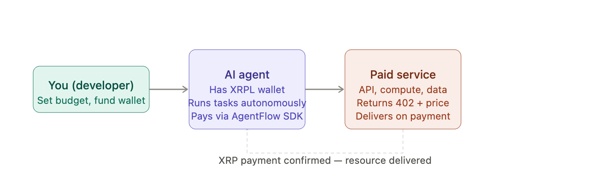
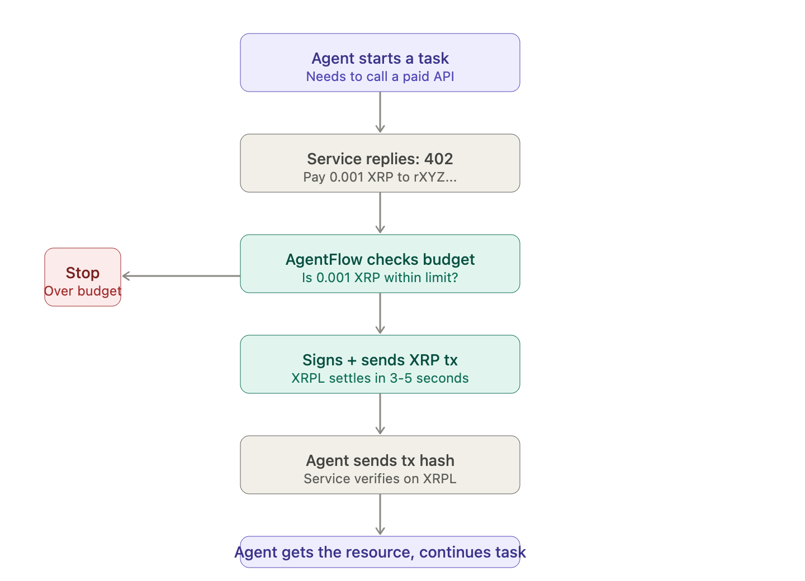
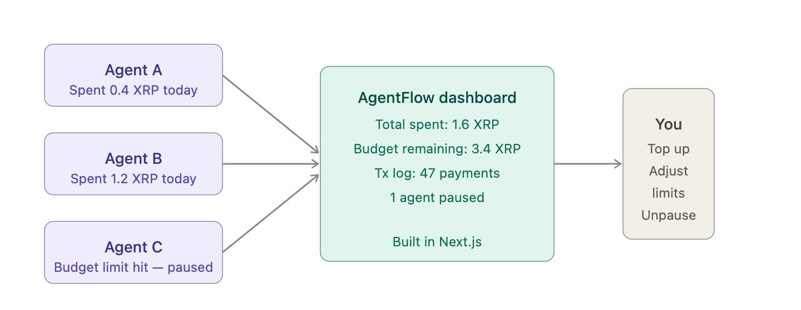

# AgentFlow

## About

AgentFlow is a payment middleware layer that lets AI agents autonomously pay for APIs, compute, and services in XRP, no human approval required. Agents hold XRPL wallets, intercept 402 payment request

## Description

AgentFlow is a payment middleware layer that lets AI agents autonomously pay for APIs, compute, and services in XRP, no human approval required. Agents hold XRPL wallets, intercept 402 payment requests, and settle micropayments in under 5 seconds using XRPL's native Payment and Payment Channel primitives. Built as an open SDK with per-agent budget policies, spend tracking, and a real-time dashboard. AgentFlow makes AI agents economically self-sufficient.

- "Middleware" just means software that sits in the middle between two things. It intercepts what's happening and handles something before passing it along.

- AI Agent → [AgentFlow middleware] → Paid Service
  ↓
  pays in XRP,
  checks budget,
  logs the spend

## What an Agent Needs

An agent that can transact on the XRP Ledger needs five things. The first three are universal; the last two are specific to AI-native workflows and make the difference between an agent that works once and one that works reliably at scale.

### A Wallet

An XRPL account with a funded balance. On Testnet, use the faucet. In production, generate a key pair and store it securely in a KMS or HSM.

### Network Access

A connection to an XRPL node via JSON-RPC or WebSocket. Public Testnet endpoints are available at altnet.rippletest.net.

### A transaction Library

xrpl-py (Python) or xrpl.js (JavaScript/TypeScript) handle serialization, signing, and submission. No raw RPC calls required.

### Machine-Readable Docs

The XRPL Docs MCP Server exposes the full developer documentation as tool-callable context, so your LLM always has accurate, up-to-date reference material.

### LLM Tool Interface

Optional but powerful: the XRPL Claude Skills file gives Claude pre-built tools for common operations — wallet creation, payments, escrow, and more.

## Userflow

### Diagram 1 — The big picture: who the actors are and how they relate.

### Diagram 2 — The payment moment: what happens step by step when the agent hits a paid service. This is the core of what AgentFlow does.

### Diagram 3 — The owner's view: what you see on the dashboard after everything runs.

## How X402 works on the XRP Ledger

The X402 flow on the XRP Ledger involves three parties: a merchant (a service that requires payment), a payer agent (a client that pays for access), and a facilitator (a service that verifies the on-chain payment and issues a signed receipt the merchant trusts).

The complete flow:

- Agent requests a resource — the agent calls a protected HTTP endpoint.
- Merchant returns 402 — the response includes the price, the payment address, and the facilitator URL in a structured header.
- Agent sends a presigned on-chain transaction — the agent submits a presigned XRP Ledger Payment transaction from the client to the merchant's wallet address for the required amount.
- Agent obtains a receipt — the agent submits the transaction hash to the facilitator, which verifies the on-chain payment and issues a signed receipt.
- Agent retries with receipt — the agent re-sends the original request with the receipt in the X-PAYMENT header.
- Merchant delivers — the merchant verifies the receipt and returns the resource.

